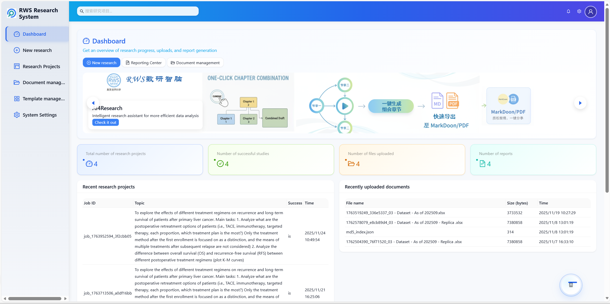
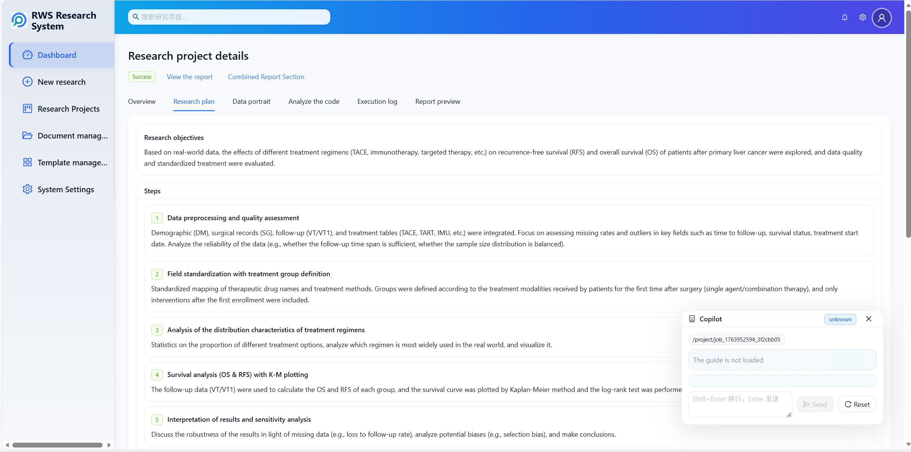
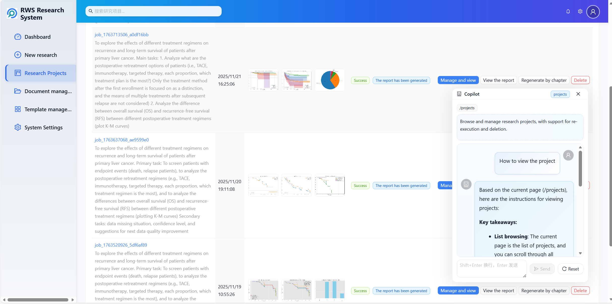
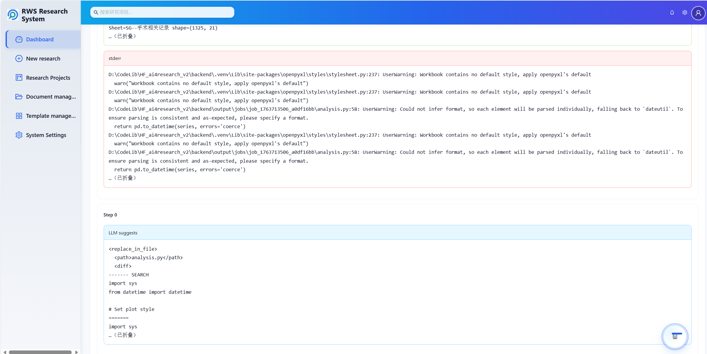
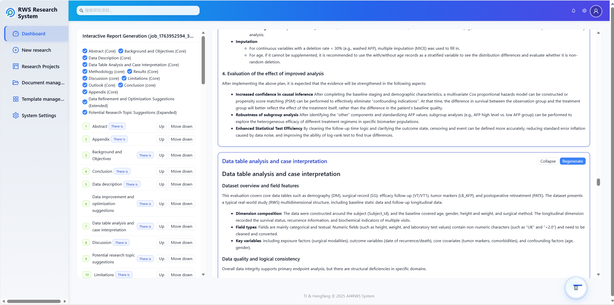
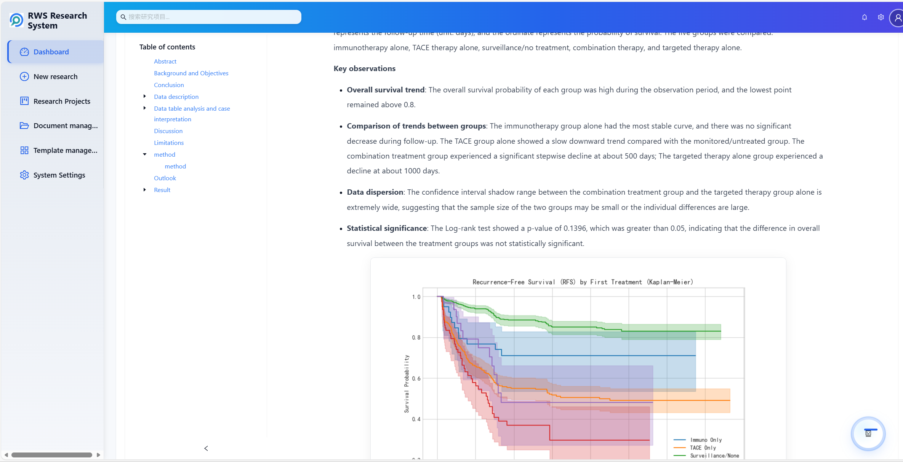

# ProCARE: Real-World Study Automation via Profile-Grounded Evidence Contracts

ProCARE is a research system for automating real-world studies (RWS) over observational health data. It follows the method described in the paper **"ProCARE: Real-World Study Automation via Profile-Grounded Evidence Contracts"**: raw tables are converted into a heterogeneous data profile, study goals are compiled into a typed RWS specification, executable analyses are generated under profile constraints, and report claims are kept within the evidence supported by validated artifacts.

This `code/` directory contains the interactive application used to run the ProCARE workflow: a FastAPI backend, a React/Vite frontend, data profiling and planning agents, OpenCode-based execution, report composition, and paper export utilities.

## Method Overview

ProCARE treats RWS automation as contract-valid artifact generation:

```text
T_goal + Phi -> Z -> C* -> O -> R, Q
```

Where:

- `Phi` is the heterogeneous data profile, recording schema structure, field statistics, clinical semantics, temporal roles, validity flags, proxies, and assumptions.
- `Z` is the typed RWS intermediate representation, covering study design, analysis grain, join graph, keys, temporal anchors, variable-role bindings, methods, artifacts, and claim policy.
- `C*` is validated executable analysis code.
- `O` is the validated artifact set, including tables, figures, manifests, logs, and execution evidence.
- `R` is the generated report.
- `Q` is the set of factual claims admitted by the available evidence and claim policy.

The framework enforces the contract at three boundaries:

1. **Query to RWS-IR**: user goals are grounded against profile-supported variables, joins, temporal anchors, endpoints, confounders, and analysis grain.
2. **RWS-IR to code**: generated code is executed in a constrained workspace and checked for schema use, artifact completeness, method consistency, and figure/report requirements.
3. **Artifacts to claims**: report text is generated from validated artifacts, source profile entries, execution logs, assumptions, and limitations.

## Code Map

```text
code/
  backend/
    app/
      agents/             # Excel, profile, plan, code, and report agents
      api/                # FastAPI routes for upload, planning, execution, reports, paper export
      core/               # LLM client, settings, audit, OpenCode runner, execution loops
      services/           # Profiling, report building, LaTeX/PDF, job storage, references
      skills/             # Local task skills for profiling, planning, coding, repair, reporting
      prompt_profiles/    # Writing and normalization prompt profiles
    data/                 # Example RWS/public datasets used by the app
    tests/                # Backend tests and sample jobs
    rws_ai_eval.py        # Evaluation utilities
  frontend/
    src/
      pages/              # Dashboard, wizard, projects, report viewer/composer, settings
      api/                # Frontend API clients
      components/         # Code/log viewers, copilots, plan previews, knowledge graph
      assets/             # UI styles
  docs/
    assistant/            # Page-level assistant guidance
    screenshots/          # Demo screenshots used below
  output/                 # Runtime jobs, uploads, profiles, and generated artifacts
  template/               # Article/LaTeX template assets
```

## Paper Concepts and Implementation Hooks

| Paper concept | Main implementation locations |
| --- | --- |
| Heterogeneous profile `Phi` | `backend/app/agents/excel_agent.py`, `backend/app/agents/data_profile_agent.py`, `backend/app/services/excel_analyzer.py`, `backend/app/services/profile_manager.py` |
| RWS planning / typed study specification | `backend/app/agents/plan_agent.py`, `backend/app/skills/research_planning*/` |
| Profile-constrained execution | `backend/app/core/opencode_runner.py`, `backend/app/services/executor.py`, `backend/app/core/sandbox_loop.py`, `backend/app/api/routes.py` |
| Code generation and repair prompts | `backend/app/agents/code_agent.py`, `backend/app/skills/code_generation/`, `backend/app/skills/code_repair/` |
| Report generation and support checks | `backend/app/agents/report_agent.py`, `backend/app/services/report_builder.py`, `backend/app/services/report_pipeline.py`, `backend/app/config/chapter_prompts.yaml` |
| Interactive workflow | `frontend/src/pages/Wizard.tsx`, `frontend/src/pages/Projects.tsx`, `frontend/src/pages/ProjectDetail.tsx`, `frontend/src/pages/ReportComposer.tsx`, `frontend/src/pages/ReportViewer.tsx` |

## Quick Start

ProCARE can be launched in two ways: with Docker or by running the backend and frontend manually.

### Option A: Docker

**Requirements**

- Docker and Docker Compose

**Run**

​```bash
cd code
docker compose up
​```

The frontend will be available at `http://127.0.0.1` and the backend at `http://127.0.0.1:8000`. After the system starts, open the frontend, go to the Settings page, and configure your LLM API key.

The `opencode` CLI is preinstalled inside the backend container, so no extra setup is required.

---

### Option B: Manual

**Requirements**

- Python 3.10+
- Node.js 18+
- An OpenAI-compatible LLM endpoint
- `opencode` CLI available on `PATH` for the OpenCode execution runner

**Backend**

​```powershell
cd code/backend
pip install -r requirements.txt
uvicorn app.main:app --host 0.0.0.0 --port 8000 --reload
​```

The backend listens on `http://127.0.0.1:8000` by default.

**Frontend**

​```powershell
cd code/frontend
npm install
npm run dev
​```

The frontend usually runs at `http://127.0.0.1:5173`. By default it calls `http://127.0.0.1:8000/api`; set `VITE_API_BASE_URL` in `code/frontend/.env` if the backend runs elsewhere.

## Workflow

1. **Upload data**: upload an Excel workbook and optional dataset description. The backend extracts workbook structure and caches a profile by file hash.
2. **Build the profile contract**: deterministic profiling captures sheets, fields, types, missingness, and preview statistics; optional LLM profiling adds semantic roles, proxy notes, and ambiguity flags.
3. **Generate and refine the plan**: the planning agent converts the research topic into a structured plan aligned with available tables, fields, joins, and analysis assumptions.
4. **Execute the analysis**: the OpenCode runner creates an executable workspace, generates analysis code, runs validation, and checks for required publication figures and manifests.
5. **Inspect artifacts**: review `plan.json`, `excel_info.json`, generated code, execution logs, figure outputs, and report drafts in the project detail pages.
6. **Compose the report**: generate or regenerate report sections, assemble `report.md`, preview figures, and export a paper-ready PDF/LaTeX bundle when needed.

Runtime artifacts are stored under:

```text
backend/output/jobs/<job_id>/
  excel_info.json
  plan.json
  profile_contract.json
  rws_ir.json
  contract_validation.json
  evidence_certificates.json
  contract_trace.json
  analysis.py or main.py
  exec_logs.json
  plots/
    figure_manifest.json
    *.png / *.pdf / *.svg
  report.md
  paper/
```

The lightweight ProCARE contract layer can also be rebuilt or queried through:

- `POST /api/contract/{job_id}/compile`
- `GET /api/contract/{job_id}`
- `GET /api/contract/{job_id}/profile`
- `GET /api/contract/{job_id}/rws_ir`
- `GET /api/contract/{job_id}/validation`
- `GET /api/contract/{job_id}/certificates`

## Demo

The screenshots below are stored in `docs/screenshots/`; the corresponding page notes live in `docs/assistant/`.

### Dashboard

Recent projects, uploads, report counts, and quick navigation into the RWS workflow.



### Study Planning

The wizard guides topic entry, Excel upload, profile inspection, plan generation, plan editing, and execution.



### Project Panel

Project pages expose the generated study plan, data profile, execution logs, plots, code, and report entry points.



### Code Execution Loop

The execution page streams code-generation and validation logs while preserving generated scripts and artifacts in the job workspace.



### Section-Level Report Composition

Reports can be generated section by section, regenerated with human notes, assembled into Markdown, and saved back to the job.



### Report Review

The report viewer renders Markdown, figures, and export actions for final inspection.



## Configuration Notes

- Backend LLM settings can be provided through `code/backend/.env` or the in-app settings page.
- `OPENAI_API_KEY`, `OPENAI_API_BASE_URL`, and `OPENAI_API_MODEL` configure the default OpenAI-compatible client.
- `OPENCODE_MODEL` can override the model used by the OpenCode runner.
- If no LLM key is configured, some backend paths return placeholder text so the UI remains reachable, but profile refinement, planning, code generation, and paper writing will not produce meaningful results.

## Tests

Backend tests are under `code/backend/tests`. If `pytest` is available in the environment:

```powershell
cd code/backend
python -m pytest tests
```

For targeted checks, run the specific test files such as `tests/test_opencode_runner.py`, `tests/test_opencode_api.py`, or `tests/test_report_pipeline_figures.py`.

## Data and Compliance

This repository is research code. Use only de-identified or otherwise authorized real-world data. A successful run means the generated bundle satisfied the implemented schema, execution, artifact, and report checks; it does not establish clinical correctness, causal validity, or regulatory sufficiency without expert review.

## Citation

If you use this code, please cite the ProCARE paper:

```bibtex
@misc{procare2026,
  title  = {ProCARE: Real-World Study Automation via Profile-Grounded Evidence Contracts},
  author = {Fan, Zhaoyu and Han, Bowen and Ou, Jincheng and Ren, Yanwei and He, Zehua and Huang, Kaiyu and He, Pengcheng and Ni, Shanshan and Gong, Chengchen and Xue, Shuai and Shi, Qingjiang},
  year   = {2026}
}
```
